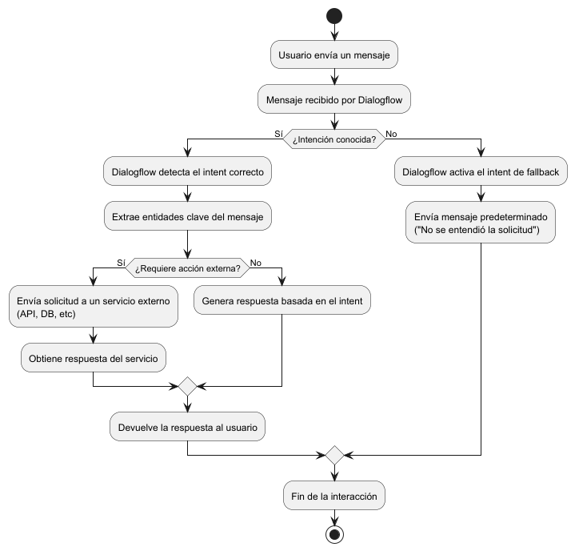
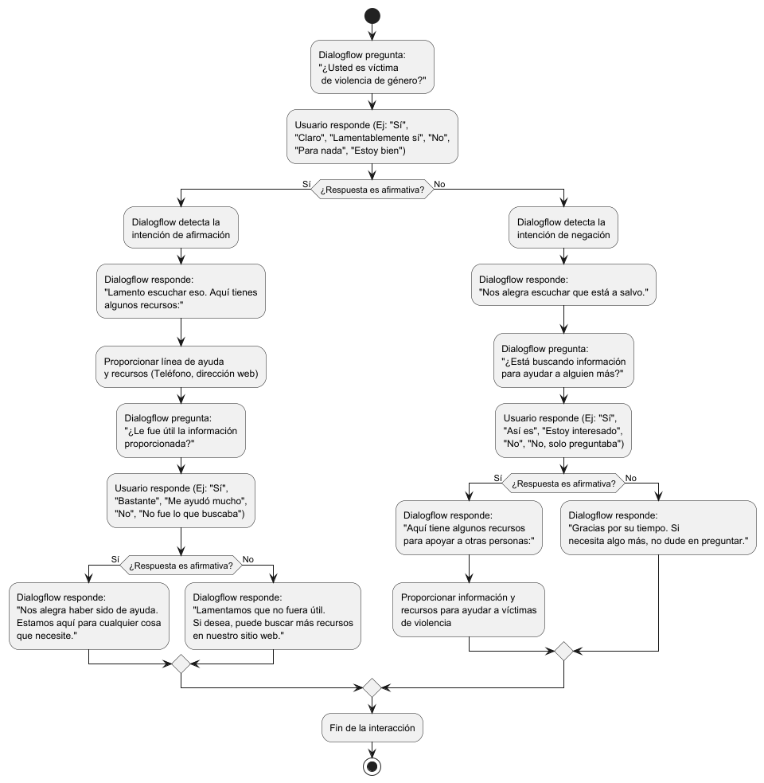

# Datos para entrenamiento de Agentes de _DialogFlow_


El presente documento tiene como objetivo describir los requerimientos necesarios para el entrenamiento
de los agentes de _DialogFlow_ que se utilizarán en el modulo de _Chatbots_ de la plataforma **_Sona_**.

Antes de describir la información necesaria para el entrenamiento de los agentes, es necesario describir
que es dialogflow, como se estructura un agente en dialogflow y algunos conceptos básicos.

## DialogFlow

Dialogflow es una plataforma de desarrollo de sistemas de diálogo basados en inteligencia artificial,
creada por Google, que permite diseñar y desplegar chatbots o asistentes virtuales capaces de entender el
lenguaje natural de los usuarios. Se usa principalmente para crear interfaces conversacionales, que pueden
entender preguntas, respuestas y comandos de voz o texto en múltiples lenguajes.

### Agentes en DialogFlow

Un agente en Dialogflow es la entidad que interpreta las intenciones (intents) de los usuarios, procesa sus
mensajes, extrae información clave (entidades) y proporciona respuestas basadas en estas interacciones. El
agente es un sistema que utiliza inteligencia artificial y procesamiento del lenguaje natural (NLP) para
comprender lo que los usuarios quieren decir y actuar en consecuencia.

### ¿Cómo actúa un agente en DialogFlow?

El flujo de conversación es la secuencia de interacciones entre el usuario y el agente. En Dialogflow, el
flujo de conversación se define mediante intenciones (intents), entidades (entities) y respuestas (responses).
Cuando un usuario envía un mensaje al agente, Dialogflow intenta identificar la intención del usuario y extraer
información relevante de su mensaje. Luego, el agente ejecuta la lógica correspondiente y proporciona una respuesta
adecuada al usuario, la cual puede generar una nueva interacción.

### Explicación de conceptos clave:

1. **Intent:**
   Un intent (intención) en Dialogflow representa una acción que el sistema debe realizar en respuesta a una entrada
   del usuario. Básicamente, es la forma en que Dialogflow mapea lo que el usuario dice con lo que la aplicación
   debe hacer. Por ejemplo, si el usuario dice "¿Cuál es el clima?", el intent correspondiente sería algo como
   "Consultar clima". Dialogflow reconoce que la intención del usuario es obtener información meteorológica y
   ejecuta la lógica apropiada para eso.
   </br>
   </br>
2. **Entidades:**
   Las entidades son piezas específicas de información que se extraen del mensaje del usuario para completar una
   tarea. Estas son similares a los parámetros que se necesitan para ejecutar una acción. Siguiendo el ejemplo del
   clima, si el usuario dice "¿Cuál es el clima en Quito?", Quito sería una entidad que corresponde a una ubicación.
   Dialogflow usa entidades para interpretar detalles importantes del mensaje y proporcionarle una respuesta más
   precisa al usuario.
   </br>
   </br>
3. **Acción externa:**
   En muchos casos, un intent puede requerir una interacción con servicios externos, como una API o una base de datos.
   Por ejemplo, si el usuario pregunta sobre el clima, Dialogflow podría enviar una solicitud a una API meteorológica
   para obtener la información actual y luego devolvérsela al usuario.
   </br>
   </br>
4. **Intent de fallback:**
   Si Dialogflow no puede identificar un intent basado en el mensaje del usuario (es decir, si el mensaje es desconocido
   o ambiguo), activa un intent de fallback. Este intent proporciona respuestas genéricas como: "No entendí tu pregunta,
   ¿podrías repetirla?". Esto ayuda a mantener la interacción fluida y permite que el usuario reformule su consulta.

A continuación se muestra un diagrama que ilustra el flujo de conversación entre una interacción de usuario y un agente



## Requerimientos para el entrenamiento de Agentes

Para el entrenamiento de los agentes de DialogFlow, se lo puede hacer de distintas maneras:

1. **Manualmente:** Creando intenciones, entidades y respuestas desde la consola de DialogFlow una ves ya habiendo
   identificado los flujos de conversación y las posibles interacciones de los usuarios.
   </br>
   </br>
2. **Almacenes de datos:** Utilizando almacenes de datos para el entrenamiento de los agentes. Los almacenes de datos
   pueden ser estructurados y no estructurados, y se los puede utilizar para entrenar agentes de DialogFlow de manera
   automática.
   </br>
   </br>
3. **Mixto:** Una combinación de los dos métodos anteriores

### Manualmente

Para el entraimiento manual de los agentes, se requiere identificar los flujos de conversación y las posibles interacciones
que los usuarios pueden tener con el agente. Esto puede ser decrito mediante un diagrama de flujo de conversación, donde
se describen las posibles interacciones y las respuestas que el agente debe dar en cada caso.
A continuación se muestra un ejemplo de un diagrama de flujo de conversación:



Como se puede observar en el diagrama de ejemplo, se define el flujo de conversación entre una usuaria y el agente de
DialogFlow. En este caso, el agente es un chatbot que brinda información y recursos a personas que han sido víctimas
de violencia de género. El diagrama describe las posibles interacciones que el usuario puede tener con el agente y las
respuestas que el agente debe dar en cada caso.

### Almacenes de datos

Para el entrenamiento automático de los agentes, se requiere un almacén de datos que contenga información relevante
para el entrenamiento. Los almacenes de datos pueden ser estructurados o no estructurados:

### Almacenes de datos estructurados

Almacena de los datos estructurados

Las reservas de datos estructuradas pueden contener respuestas a preguntas frecuentes (FAQ). Cuando las preguntas del
usuario se combinan con alta confianza a una pregunta subida, el agente devuelve la respuesta a esa pregunta sin ninguna
modificación. Puede proporcionar un título y una URL para cada pregunta y par de respuestas que es exhibida por el agente.

Al cargar los datos en el almacén de datos, se debe utilizar el formato CSV. Cada archivo Debe tener una fila de cabecera
que describa las columnas.

Por ejemplo:

| question                                             | answer                                                                                                                                                                                                                                                                                | title                 | url                                                                                            |
|------------------------------------------------------|---------------------------------------------------------------------------------------------------------------------------------------------------------------------------------------------------------------------------------------------------------------------------------------|-----------------------|------------------------------------------------------------------------------------------------|
| ¿Que organismo defiende los derechos de las mujeres? | La Secretaría de Derechos Humanos y la Secretaría de Derechos Humanos de la Presidencia de la República                                                                                                                                                                               | Defensoría del Pueblo | [https://www.defensoria.gob.ec/](https://www.defensoria.gob.ec/)                               |
| ¿Qué es la violencia de género?                      | La violencia de género es cualquier acto de violencia basado en el género que tiene como resultado posible o real un daño físico, sexual o psicológico, incluidas las amenazas, la coerción o la privación arbitraria de la libertad, ya sea que ocurra en la vida pública o privada. | Violencia de género   | [https://www.un.org/es/observances/ending-viol](https://www.un.org/es/observances/ending-viol) |
| ¿Qué es la violencia sexual?                         | La violencia sexual es cualquier acto sexual, intento de obtener un acto sexual, comentarios o insinuaciones sexuales no deseados, o tráfico de personas con fines sexuales.                                                                                                          | Violencia sexual      | [https://www.un.org/es/observances/ending-viol](https://www.un.org/es/observances/ending-viol) |

Tener en cuenta que CSV es un formato de archivo de texto que contiene valores separados por comas. No confundir con
el formato de archivo de Excel, originalmente un CSV tiene el siguiente aspecto cuando se abre con un editor de texto:

```csv
"question","answer","title","url"
"¿Que organismo defiende los derechos de las mujeres?","La Secretaría de Derechos Humanos y la Secretaría de Derechos Humanos de la Presidencia de la República","Defensoría del Pueblo","https://www.defensoria.gob.ec/"
"¿Qué es la violencia de género?","La violencia de género es cualquier acto de violencia basado en el género que tiene como resultado posible o real un daño físico, sexual o psicológico, incluidas las amenazas, la coerción o la privación arbitraria de la libertad, ya sea que ocurra en la vida pública o privada.","Violencia de género","https://www.un.org/es/observances/ending-viol"
"¿Qué es la violencia sexual?","La violencia sexual es cualquier acto sexual, intento de obtener un acto sexual, comentarios o insinuaciones sexuales no deseados, o tráfico de personas con fines sexuales.","Violencia sexual","https://www.un.org/es/observances/ending-viol"
```

El `title` y `url` son opcionales, pueden omitirse.

### Almacenes de datos no estructurados

Almacena de datos no estructurado

Las reservas de datos no estructuradas pueden contener contenido en los siguientes formatos:

* HTML
* PDF
* TXT
* CSV

```textplain
Nota:Los archivos CSV también pueden ser importados como contenido no estructurado. Se aplican los mismos requisitos de esquema.
Metadatos se generan automáticamente, si `title` y `url` se proporcionan columnas. Cada par de preguntas y respuestas se indexa
por separado. Los requisitos de correspondencia son menos estrictos en comparación con los datos estructurados de CSV tiendas,
y la respuesta podría ser reescrita por el agente.
```

* El tamaño máximo del archivo es de 2,5MB para formatos basados en texto, 100MB para otros formatos.

Para nuestro caso los ejemplos de almacences de datos no estructurado que se pueden utilzar son:

* **HTML:** Páginas web con información acerca de la violencia de género, derechos de las mujeres, etc.
* **PDF:** Documentos como libros, revistas, informes, con información acerca de la violencia de género, medidas de protección, etc.
* **TXT:** Archivos de texto planos con información acerca de la violencia de género, derechos de las mujeres, etc.